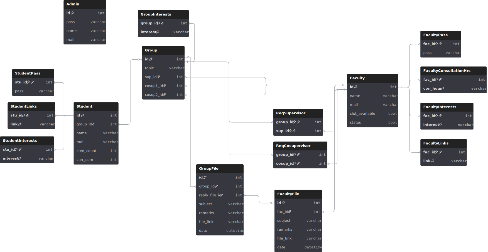

# CSE 370 Project: Thesis Management and Information Website

Welcome to the CSE 370 Project repository!  
This project is a comprehensive Thesis Management and Information Website designed to streamline the thesis process for both students and supervisors.

---

## 🚀 Main Features

### Supervisor Selection
- Students can browse a list of supervisors, view their status (accepting new students or not), and see available slots.

### Group Formation
- Students view peers' profiles and form groups based on shared interests.
- Group requests can be sent to supervisors for slot booking.

### Slot Booking System
- Groups request supervisors for thesis supervision.
- Supervisors can accept or reject requests based on their group limits.
- Approved groups have other pending requests automatically removed.

### Student Profile & Gradesheet Sharing
- Students submit profiles, including GitHub links and gradesheets.
- Supervisors review these profiles before accepting students.

### Thesis File Submission
- Students upload thesis files (PDF, LaTeX, etc.) for supervisor review.

### Supervisor Feedback System
- Supervisors provide feedback via dashboard comments or email.

---

## 📄 See Also

- [Features.md](./Features.md) — Full list and descriptions of all features.

---

# Enhanced Entity-Relationship Diagrams

## Visual Previews

# Database Schema Diagram

---
